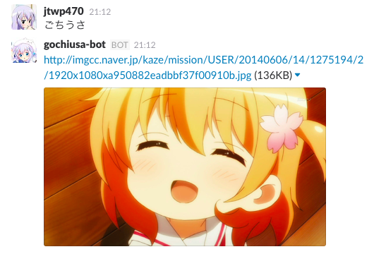
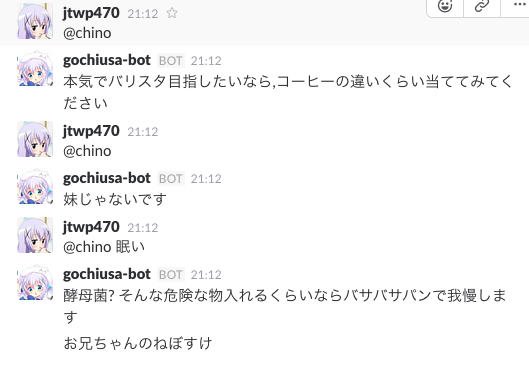
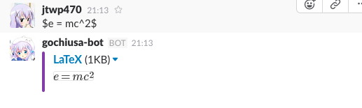
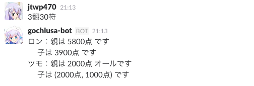
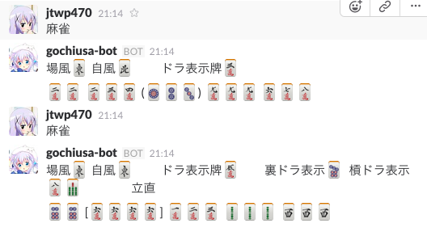
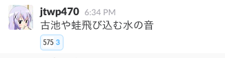

# gochiusa-bot

gochiusa-bot is "Is the order a rabbit?" BOT.

(Inspired by [Makibot](https://github.com/sanographix/makibot))

## Feature

* ごちうさというフレーズに反応してアニメ画像をランダムで吐きます.
	
* chino / @chino でチノちゃんがランダムでつぶやきます.
	
* `$`で囲まれた部分をLaTeXと認識して数式を画像化したものを返します.
	
* 麻雀点数計算機能
    * `3翻30符`とかで点数を返します. (Thanks to [@dorapon2000](https://github.com/dorapon2000))
	  
    * 麻雀役出力機能 (Thanks to [@index30](https://github.com/index30), [@sga0221](https://github.com/sga0221), [@ksepynoin](https://github.com/ksepynoin))
      
* ごちうさ言語の利用 (詳細は`glang help`を参考のこと)
* マジカルシルクハットゲーム機能
    * 遊戯王の「マジカルシルクハット」を元にしたゲーム機能です.マジカルシルクハットに隠れた「ブラック・マジシャン」を当てれば勝ち.
* 575通知機能
	* 発言した文章が575だった場合にadd-reactionしてくれる機能
	  

## How to contribute

1. [Fork](https://github.com/jtwp470/gochiusa-bot/fork) this repository.
2. Check other pull request because we don't accept a redudant request.
3. Push and submit your pull request. (Please submit your code to accept CI test.)

Please refer to the [wiki](https://github.com/jtwp470/gochiusa-bot/wiki) if you will send your pull request. (Japanese)

### :warning: CAUTION
文法チェックを追加しました.CoffeeScriptが正しく書かれていないとエラーになります.(例えば2インデントのところを4インデントにしているなど)
この文法チェックを通過するコードのみしかプルリクエストを受け付けないので気をつけてください.

自分の環境で文法チェックをするときは`coffeelint`や`npm test`などを使ってみてください.

Please check your code using `coffeelint` or `npm test` if you send me your pull request.
I don't accept when your code is not passed the lint tests and running coffee.

## Contributors

* @dorapon2000
    * [点数計算機能の追加](https://github.com/jtwp470/gochiusa-bot/pull/13)
* @index30, @sga0221, @ksepynoin
    * [麻雀役を出力する機能の追加](https://github.com/jtwp470/gochiusa-bot/issues/14)
    * [麻雀役を出力する機能のソースコード改善](https://github.com/jtwp470/gochiusa-bot/issues/21)
* @sga0221
    * [マジカルシルクハットゲーム機能の追加](https://github.com/jtwp470/gochiusa-bot/pull/62)

## License
The MIT License (MIT)

Copyright (c) 2015 jtwp470

Permission is hereby granted, free of charge, to any person obtaining a copy
of this software and associated documentation files (the "Software"), to deal
in the Software without restriction, including without limitation the rights
to use, copy, modify, merge, publish, distribute, sublicense, and/or sell
copies of the Software, and to permit persons to whom the Software is
furnished to do so, subject to the following conditions:

The above copyright notice and this permission notice shall be included in
all copies or substantial portions of the Software.

THE SOFTWARE IS PROVIDED "AS IS", WITHOUT WARRANTY OF ANY KIND, EXPRESS OR
IMPLIED, INCLUDING BUT NOT LIMITED TO THE WARRANTIES OF MERCHANTABILITY,
FITNESS FOR A PARTICULAR PURPOSE AND NONINFRINGEMENT. IN NO EVENT SHALL THE
AUTHORS OR COPYRIGHT HOLDERS BE LIABLE FOR ANY CLAIM, DAMAGES OR OTHER
LIABILITY, WHETHER IN AN ACTION OF CONTRACT, TORT OR OTHERWISE, ARISING FROM,
OUT OF OR IN CONNECTION WITH THE SOFTWARE OR THE USE OR OTHER DEALINGS IN
THE SOFTWARE.
